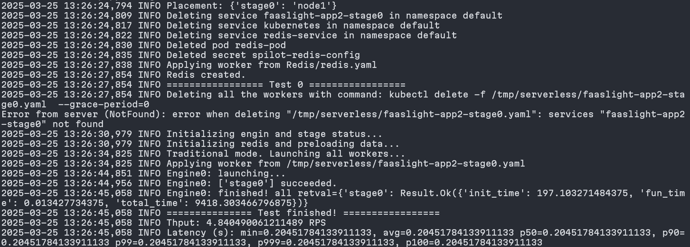
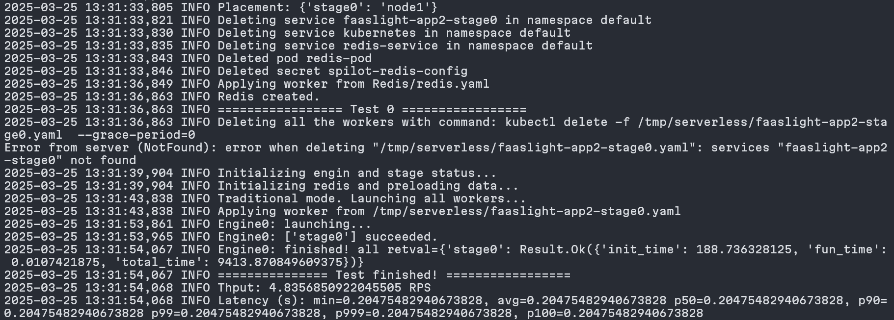

1. Testing command
```bash
# benchmark
./bench-script.sh ~/serverless-app/FaaSLight-App/app2/Faaslight-App2 app2 ~/serverless-app/FaaSLight-App/app2
# Faaslight
./test-script.sh ~/serverless-app/FaaSLight-App/app2/Faaslight-App2 app2 ~/serverless-app/FaaSLight-App/app2/Faaslight-App2-modified ~/serverless-app/FaaSLight-App/app2
```
2. Testing result

benchmark

Faaslight
